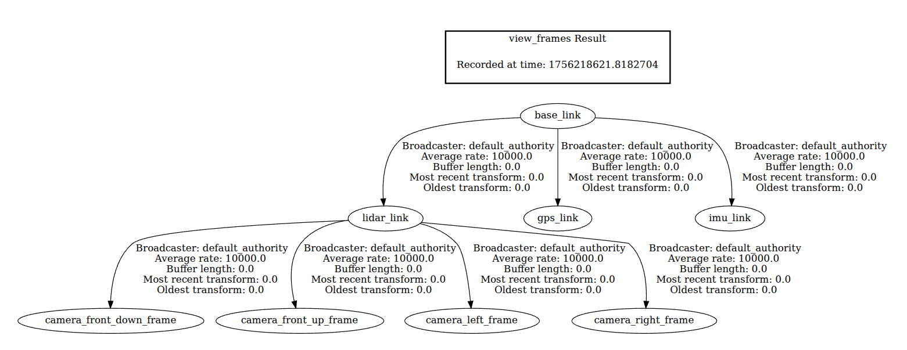
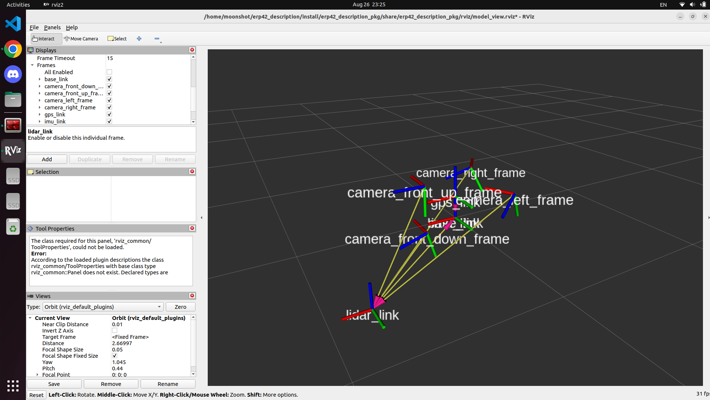

# erp42_description_pkg

A minimal ROS 2 package to publish **sensor TF frames from a single URDF/Xacro** and optionally launch **RViz2** for visualization.

- Single robot description: `urdf/erp42_robot.urdf.xacro`
- TF broadcast via `robot_state_publisher`
- RViz preset: `rviz/model_view.rviz` (Fixed Frame = `base_link`, TF on)

---

## Package Overview
```
erp42_description_pkg/
├── launch/
│ ├── state_publisher.launch.py # URDF → TF only
│ └── state_publisher_display.launch.py # URDF → TF + RViz2
├── rviz/
│ └── model_view.rviz # base_link as Fixed Frame, TF enabled
├── urdf/
│ └── erp42_robot.urdf.xacro # base_link + LiDAR + cameras
├── CMakeLists.txt
├── package.xml
└── README.md
```

### TF Tree


### TF Rviz Visualization


### TF Broadcast only
```
ros2 launch erp42_description_pkg state_publisher.launch.py
```

### TF + RViz2
```
ros2 launch erp42_description_pkg state_publisher_display.launch.py
```

### Maintainer

Author: Hyeongjin Kim  
Email: ky942400@gmail.com  
License: MIT